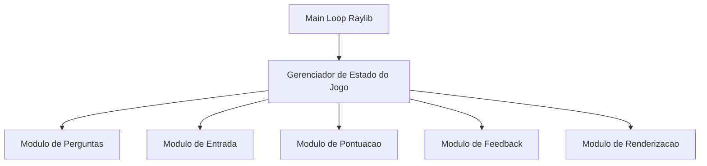
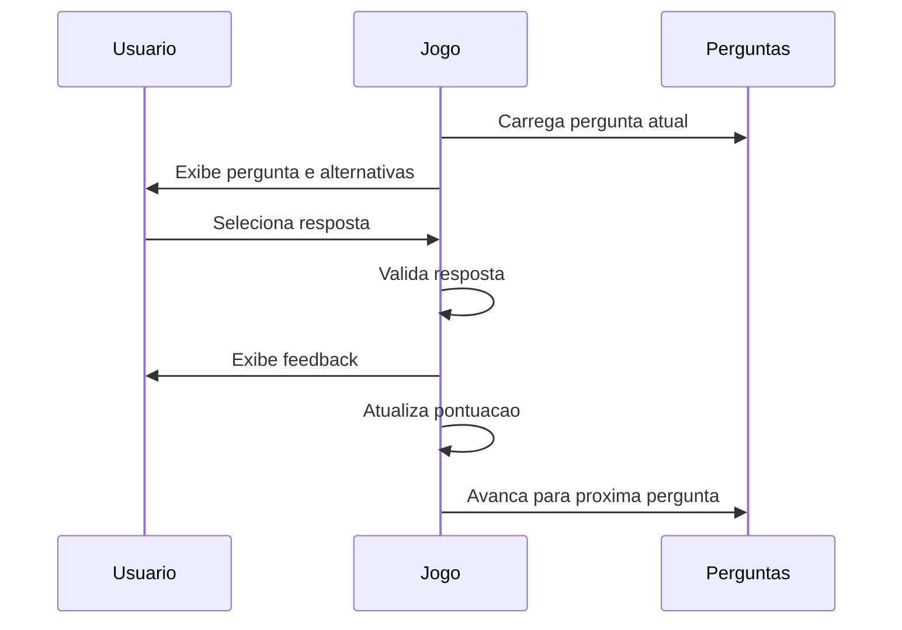
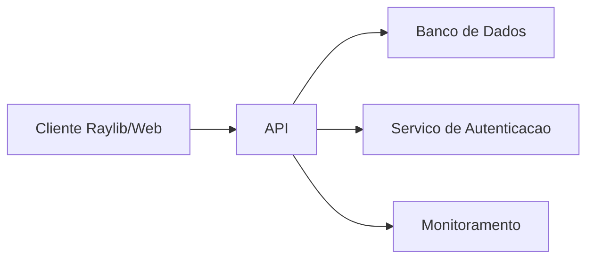

# Arquitetura do Projeto

## Visao Geral

O projeto e um jogo desktop simples desenvolvido em C com Raylib. A primeira versao usa dados em memoria e nao depende de servidor, banco de dados ou internet.

## Componentes



## Estrutura Recomendada de Pastas

```text
quiz-matematica/
  README.md
  docs/
    planejamento_produto.md
    elicitacao_5w2h.md
    arquitetura.md
    plano_seguranca.md
    plano_ux_ui.md
    plano_cloud.md
  src/
    main.c
    game.c
    game.h
    questions.c
    questions.h
    ui.c
    ui.h
  assets/
    fonts/
    sounds/
    images/
  build/
  Makefile
```

## Modulos

### `main.c`

Responsavel por:

- Inicializar a janela.
- Controlar o loop principal.
- Encerrar o jogo.

### `game.c` e `game.h`

Responsaveis por:

- Estado atual do jogo.
- Pergunta atual.
- Pontuacao.
- Regras de avancar para a proxima pergunta.

### `questions.c` e `questions.h`

Responsaveis por:

- Estrutura `Question`.
- Lista de perguntas.
- Futuramente, carregamento de perguntas externas.

### `ui.c` e `ui.h`

Responsaveis por:

- Desenho dos botoes.
- Cores da interface.
- Feedback visual.
- Layout.

## Modelo de Dados

```c
typedef struct {
    const char *question;
    const char *options[4];
    int correctIndex;
} Question;
```

## Fluxo do Jogo



## Estados do Jogo

- `PLAYING`: usuario esta respondendo.
- `ANSWERED`: resposta foi escolhida e feedback esta visivel.
- `FINISHED`: quiz terminou e resultado final e exibido.

## Possivel Arquitetura Online Futura



## Decisoes Tecnicas

- Raylib foi escolhida pela simplicidade e foco didatico.
- C foi mantido por ser linguagem base do requisito.
- Dados em memoria simplificam o MVP.
- Modularizacao facilita evolucao para arquivos externos, dificuldade e relatorios.
