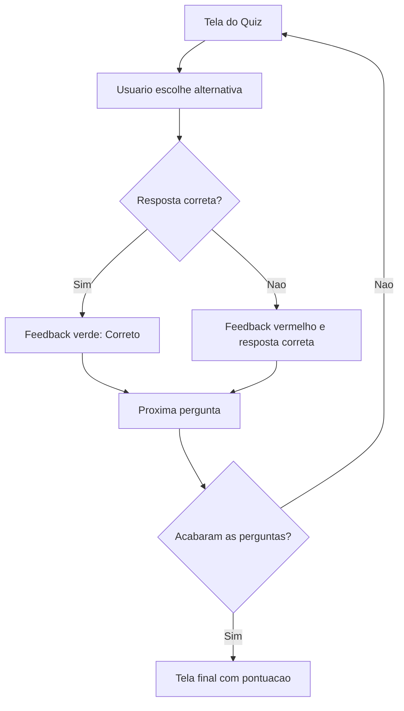

# Plano de UX/UI

## Principios de Experiencia

- Clareza: a crianca deve entender rapidamente o que fazer.
- Legibilidade: textos grandes, simples e com bom contraste.
- Baixa carga cognitiva: apenas uma pergunta por tela.
- Feedback imediato: cores e mensagens apos a resposta.
- Incentivo positivo: erros devem ensinar, nao punir.

## Direcao Visual

O design deve ser limpo, amigavel e inspirado em principios do Material Design:

- Uso de superficie clara.
- Botoes com estados visuais.
- Hierarquia tipografica simples.
- Cores funcionais para acerto e erro.
- Espacamento generoso.

## Design System Inicial

### Cores

| Uso | Cor sugerida |
|---|---|
| Fundo | Azul muito claro ou branco suave |
| Titulo | Azul escuro |
| Texto principal | Preto ou cinza escuro |
| Botao normal | Branco |
| Botao hover | Azul claro |
| Correto | Verde |
| Errado | Vermelho |
| Neutro | Cinza |

### Tipografia

- Fonte padrao da Raylib para MVP.
- Titulo: tamanho 32 a 40.
- Pergunta: tamanho 28 a 32.
- Alternativas: tamanho 22 a 26.
- Feedback: tamanho 30 a 36.

### Componentes

#### Botao de Alternativa

- Retangulo com borda.
- Texto alinhado a esquerda.
- Estado hover.
- Estado correto em verde.
- Estado incorreto em vermelho.

#### Placar

- Exibido no topo.
- Texto curto: `Pontuacao: X`.

#### Feedback

- Mensagem central ou inferior.
- Exibir `Correto!` em verde.
- Exibir `Errado! Resposta correta: ...` em vermelho/cinza.

## Fluxo de Tela

## Acessibilidade

- Alto contraste entre texto e fundo.
- Tamanho de fonte adequado.
- Uso de teclado com A, B, C, D.
- Cores acompanhadas de texto, para nao depender apenas de cor.
- Evitar textos longos nas alternativas.

## Tom de Comunicacao

- Positivo.
- Simples.
- Encorajador.

Exemplos:

- `Correto! Muito bem.`
- `Quase! A resposta correta era B) 56.`
- `Voce concluiu o quiz!`

## Melhorias Futuras

- Sons suaves de acerto e erro.
- Animacoes discretas.
- Personagem guia.
- Medalhas por desempenho.
- Modo treino sem pressao de tempo.
