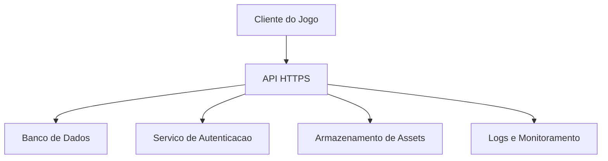

# Plano de Instanciamento em Cloud

## Contexto

O MVP em Raylib e executado localmente. Uma versao em cloud passa a fazer sentido quando houver necessidade de salvar pontuacoes, gerenciar turmas, publicar perguntas remotamente ou disponibilizar o jogo em ambiente escolar com multiplos usuarios.

## Arquitetura Cloud Sugerida

## Opcoes de Hospedagem

### Opcao Simples

- Servidor pequeno Linux.
- API leve.
- Banco SQLite ou PostgreSQL.
- HTTPS com certificado gratuito.

Indicada para piloto escolar.

### Opcao Gerenciada

- API em container.
- Banco PostgreSQL gerenciado.
- Armazenamento de arquivos em bucket.
- Monitoramento gerenciado.

Indicada para producao com mais usuarios.

## Componentes

| Componente | Funcao |
|---|---|
| API | Salvar pontuacoes, listar perguntas, autenticar usuarios |
| Banco de dados | Guardar usuarios, perguntas e resultados |
| Storage | Guardar imagens, sons e materiais |
| CDN | Entregar assets com menor latencia |
| Monitoramento | Acompanhar erros, uso e disponibilidade |

## Ambientes

- Desenvolvimento: testes locais.
- Homologacao: validacao com professores.
- Producao: ambiente usado por alunos.

## Passos de Instanciamento

1. Criar repositorio GitHub/GitLab.
2. Criar pipeline de build e testes.
3. Criar servidor ou servico de container.
4. Configurar banco de dados.
5. Configurar variaveis de ambiente.
6. Habilitar HTTPS.
7. Publicar API.
8. Configurar monitoramento.
9. Criar rotina de backup.
10. Documentar procedimento de rollback.

## Dimensionamento Inicial

Para piloto:

- 1 vCPU.
- 1 GB de RAM.
- Banco pequeno.
- Baixo trafego.

Para escola com muitas turmas:

- 2 vCPU ou mais.
- 2 a 4 GB de RAM.
- PostgreSQL gerenciado.
- Backups diarios.

## Custos Computacionais

O custo tende a ser baixo porque o jogo e leve. O maior consumo aparece quando:

- Muitos alunos acessam ao mesmo tempo.
- Ha armazenamento historico de resultados.
- Relatorios sao gerados com frequencia.
- Assets ficam mais pesados.

## Recomendacoes

- Comecar com arquitetura simples.
- Evitar coletar dados pessoais desnecessarios.
- Usar logs e backups desde o piloto.
- Automatizar publicacao.
- Separar ambientes de teste e producao.
